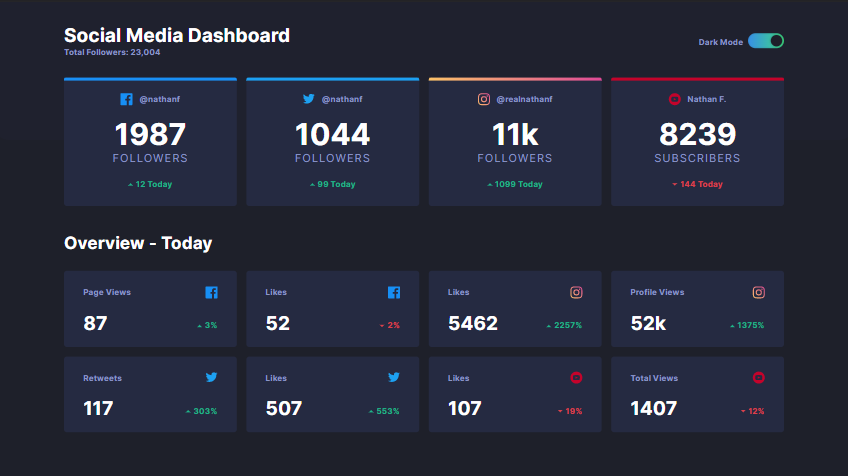

# Frontend Mentor - Social media dashboard with theme switcher

## Contents

- [Overview](#overview)
- [Screenshot](#preview)
- [Links](#links)
- [Built with](#built-with)
- [Author](#author)
- [Acknowledgements](#acknowledgments)

## Overview

This is a solution to the [Social media dashboard with theme switcher challenge on Frontend Mentor](https://www.frontendmentor.io/challenges/social-media-dashboard-with-theme-switcher-6oY8ozp_H)

## Preview

## Links

- [Solution URL](https://github.com/dostonnabotov/social-media-dashboard-with-theme-switcher-master)
- [Live Site URL](https://dostonnabotov.github.io/social-media-dashboard-with-theme-switcher-master/)

## Built with

- Semantic HTML5 markup
- Sass
- JavaScript
- mobile-first workflow

## Author

- Website - [Doston Nabotov](https://www.dostonnabotov.netlify.com)
- Frontend Mentor - [@dostonnabotov](https://www.frontendmentor.io/profile/dostonnabotov)
- Github - [@dostonnabotov](https://www.github.com/dostonnabotov)

## Acknowledgements

- [Content Template element](https://developer.mozilla.org/en-US/docs/Web/HTML/Element/template) - MDN
- [Theme Switcher Functionality](https://www.youtube.com/watch?v=wodWDIdV9BY&t=884s) - Kevin Powell
- [Selecting multiple attributes at once in JS](https://stackoverflow.com/questions/12274748/setting-multiple-attributes-for-an-element-at-once-with-javascript) - Stackoverflow